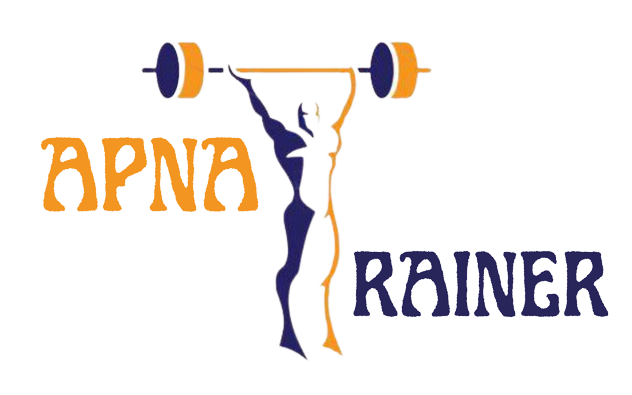

# Personal Trainer Website

  

## 🚀 About the Project

This Personal Trainer Website is a web platform designed for personalized fitness training. It features live video sessions, secure payment integration, and real-time communication to foster effective trainer-client interactions.

## 🛠️ Technologies Used

### Frontend

- **React.js**: A JavaScript library for building user interfaces.

### Backend

- **Node.js**: A JavaScript runtime built on Chrome's V8 JavaScript engine.
- **Express.js**: A minimal and flexible Node.js web application framework for creating APIs.

### Database

- **MongoDB**: A NoSQL database for storing user and training data.

## ✨ Features

- **Live Video Sessions**: Personalized fitness training through live video.
- **Secure Payment Gateway**: Integrated with RazorPay for secure transactions.
- **Real-Time Chat**: WebSocket-powered chat feature for real-time communication between trainers and clients.

## 📸 Screenshots

### Home Screen

### Client Side

### Client Dashboard

### Client Trainers

### Find New Trainer

### Trainer Profile

### Trainer Plans

### Buy Plan

### Chat Screen

### Video Session

### Trainer Side

### Trainer Dashboard

### Plans Management

### Clients Management

### Add Schedule

